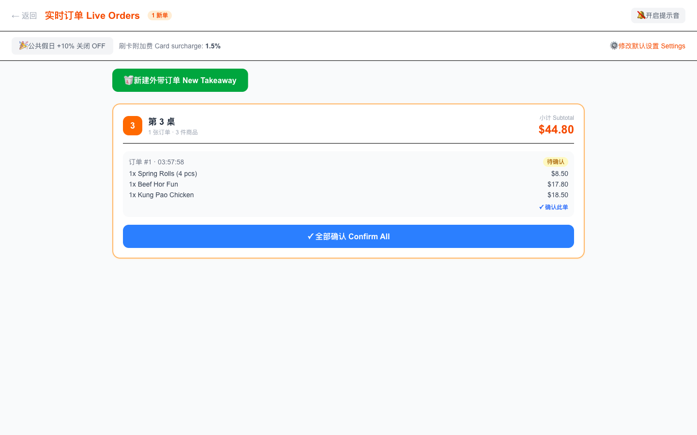
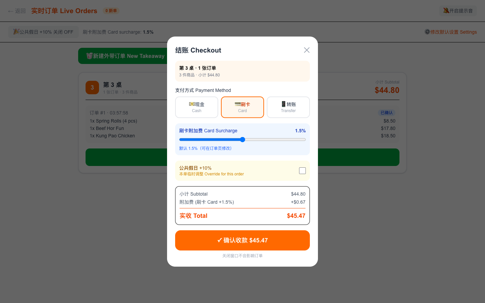
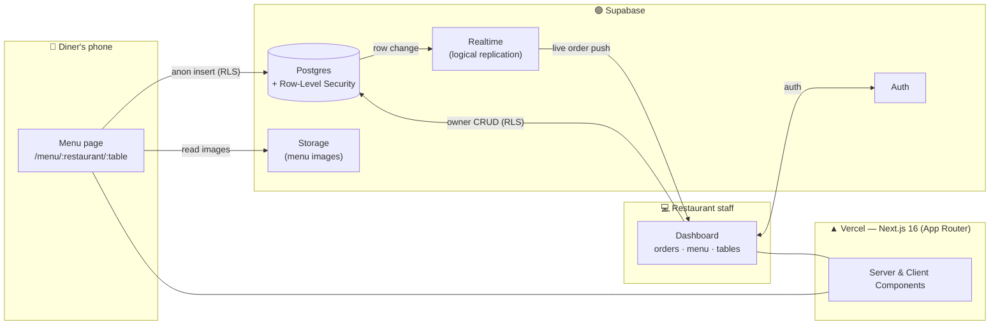

# 🍜 OrderKing

**A production full-stack QR-code ordering & point-of-sale SaaS for restaurants.**
Diners scan a table QR code, order from their phone, and the kitchen sees the
order appear live — no app install, no waiter, no hardware beyond a screen.

<p>
  
  
  
  
  
</p>

🔗 **Live demo:** [www.orderking.uk](https://www.orderking.uk)
📱 **Order as a customer (no login):** [Demo Kitchen — Table 3](https://www.orderking.uk/menu/11111111-1111-1111-1111-111111111111/3) — add items and place an order.
💻 **See the kitchen side:** log in at [/auth/login](https://www.orderking.uk/auth/login) with **`demo@orderking.uk`** / **`123456`** and watch the order you just placed appear live, then check it out.

> Built and shipped solo by an undergraduate CS student, then taken to real
> Sydney restaurants for in-person sales. See [What I learned](#-what-i-learned) — the
> most valuable part of this project wasn't the code.

---

## 📸 Screenshots

| Customer ordering (mobile) | Live kitchen dashboard | Checkout |
| :---: | :---: | :---: |
|  |  |  |

---

## ✨ Features

- **📱 QR ordering, zero install** — each table has a QR code; diners order straight from the browser.
- **⚡ Real-time kitchen dashboard** — orders push live to staff via Supabase Realtime (Postgres logical replication), grouped by table, with a sound alert.
- **🧾 Built-in POS checkout** — cash / card / bank-transfer, automatic card surcharge, public-holiday surcharge toggle, change calculation, and table-level bill merging.
- **🥡 Dine-in & takeaway** — auto-numbered takeaway tickets (T01, T02…) that live alongside table orders in one queue.
- **🍽️ Self-service menu management** — categories, images, prices, and availability, all editable by the owner.
- **🔢 One-click QR table cards** — generate printable table cards (restaurant name + table number + QR) on the fly.
- **↩️ Undo checkout & daily takings** — revert a mistaken payment; see today's revenue split by payment method.
- **🌏 Bilingual UI** — English / Chinese throughout.

---

## 🏗️ Architecture



**Flow:** a diner scans a table QR → opens the public menu (read access scoped by
Row-Level Security) → places an order (anonymous insert) → Postgres emits the change
over logical replication → Supabase Realtime pushes it to the authenticated kitchen
dashboard within ~1s. No polling, no websockets to manage by hand.

### Order lifecycle

```
Dine-in:   scan QR → pending → ✓ confirm → confirmed → 💰 checkout → paid
Takeaway:  staff creates (T01) → pending → ✓ confirm → confirmed → 💰 checkout → paid
```

---

## 🧰 Tech stack

| Layer | Choice | Why |
| --- | --- | --- |
| Framework | **Next.js 16** (App Router, Turbopack) | One codebase for the public menu, the dashboard, and server logic |
| Language | **TypeScript** | Shared domain types (`lib/types.ts`) across client and server |
| Database | **Supabase Postgres** | Relational data (orders, items, tables) + Row-Level Security |
| Realtime | **Supabase Realtime** | Live order push without hand-rolled websockets |
| Storage / Auth | **Supabase Storage / Auth** | Menu images + restaurant owner accounts |
| Styling | **Tailwind CSS 4** | Fast, consistent mobile-first UI |
| Hosting | **Vercel** + **Cloudflare** DNS | Zero-config deploys, custom domain |

---

## 🗂️ Data model (core tables)

```
restaurants ──┬──< categories ──< menu_items
              ├──< tables
              └──< orders ──< order_items

restaurants  id, name, owner_id, address, card_surcharge_pct, ph_surcharge_pct, ph_active
orders       id, restaurant_id, table_id?, table_number, order_type, status,
             total, surcharge, grand_total, payment_method, cash_received,
             change_given, paid_at, customer_name?, customer_phone?
order_items  id, order_id, menu_item_id, name, price, quantity
```

---

## 🚀 Run it locally

```bash
# 1. Clone
git clone https://github.com/Ryan87834/orderking.git
cd orderking

# 2. Install
npm install

# 3. Configure environment
cp .env.example .env.local
#   → fill in your Supabase URL + anon key

# 4. Set up the database
#   Run supabase-schema.sql in your Supabase project's SQL editor.

# 5. Develop
npm run dev        # http://localhost:3000
```

**Environment variables** (see [`.env.example`](.env.example)):

| Variable | Description |
| --- | --- |
| `NEXT_PUBLIC_SUPABASE_URL` | Your Supabase project URL |
| `NEXT_PUBLIC_SUPABASE_ANON_KEY` | Supabase anonymous (public) key |

---

## 🔬 Engineering highlights

Real problems solved while shipping this — the parts worth talking through:

- **Secure anonymous ordering with RLS.** Diners are unauthenticated, yet must read
  one restaurant's menu and insert orders without seeing anyone else's data. Solved
  with scoped Row-Level Security policies (public `SELECT` on menu data, controlled
  `INSERT` on orders) and client-generated UUIDs so an insert never needs a follow-up
  `SELECT` it isn't allowed to make.
- **Reliable real-time delivery.** Orders are pushed via Postgres logical replication.
  Subtle gotcha learned the hard way: a Supabase channel must bind its callback
  *before* `subscribe()`, and target tables must be added to the realtime publication —
  otherwise events silently never arrive.
- **Correct money math at the counter.** Configurable card and public-holiday
  surcharges, change calculation, and merging several orders on one table into a single
  bill — all persisted so a refresh never loses state, with an undo path for mistakes.
- **One queue, two order types.** Dine-in and takeaway share the `orders` table via an
  `order_type` discriminator and a nullable `table_id`, with takeaway tickets
  auto-numbered independently of physical tables.
- **Mobile-first, install-free UX.** The whole diner experience is a single responsive
  web page — the friction of "download our app" is exactly what kills QR ordering, so
  there is no app.

---

## 💡 What I learned

I built OrderKing end-to-end, deployed it, then walked into Sydney restaurants to sell
it in person. **It got zero sign-ups** — and that taught me more than the code did.

The product was a *me-too*: restaurants that wanted QR ordering already had mature POS
systems, and the ones that didn't treated table service as a selling point, not a cost.
I'd built a polished solution to a problem my target customers didn't feel.

The lesson I carry forward: **validate demand before writing code.** Talk to users,
find a real and painful problem, and only then build. OrderKing is a strong piece of
engineering — and a formative lesson in product judgment.

---

## 📄 License

[MIT](LICENSE) © Junyu Chen
